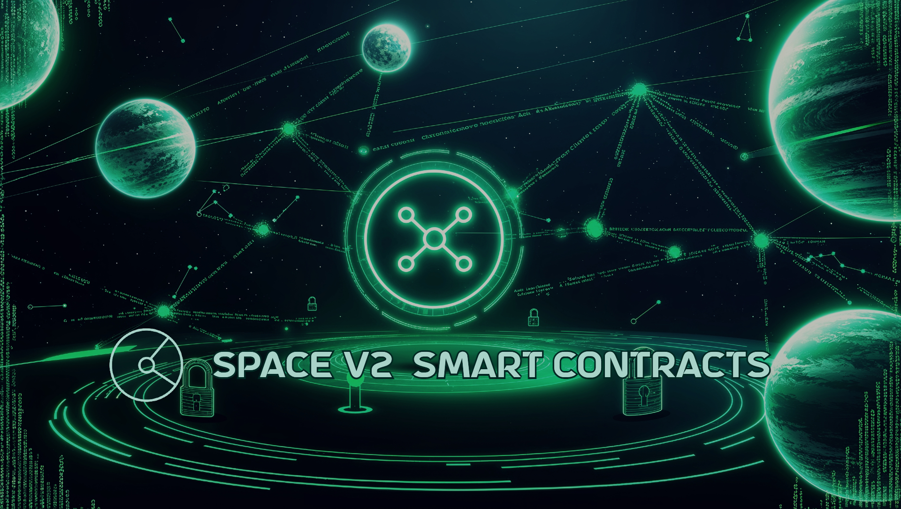

# Space V2 Smart Contracts

This repository contains the smart contracts for [Space V2](https://spacev2.org) projects. The purpose of this repository is to share the code with the community to ensure transparency and foster collaboration.

### Smart Contracts

#### Space V2 Shares Token

- Contract Address: 0x666EfB54ebC0a823370305b1af57917e135FF272
- [Contract On Arbiscan](https://arbiscan.io/address0x666EfB54ebC0a823370305b1af57917e135FF272)
- [Contract Code](https://github.com/spacev2-org/smart-contracts/blob/main/contracts/SpaceV2Shares.sol)

#### Space V2 Income

- Contract Address: 0x8413962B581A7e3Ae5D75Eaa251F158C7cB6bE46
- [Contract On Arbiscan](https://arbiscan.io/address/0x8413962B581A7e3Ae5D75Eaa251F158C7cB6bE46)
- [Contract Code](https://github.com/spacev2-org/smart-contracts/blob/main/contracts/SpaceV2Income.sol)

